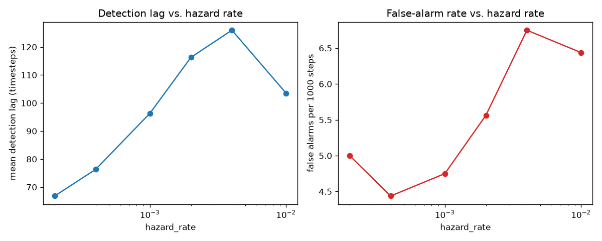

# RAGB — Regime-Adaptive Gradient Boosting

BOCPD-driven soft-weighted gradient boosting for structural breaks in financial time series. A
gradient-boosted ensemble trained on historical fraud/credit-risk data implicitly assumes
stationarity, but fraud tactics shift and macro shocks change default drivers — leaving a choice
between a stale model (silent decay) or a naive full retrain (expensive, discards useful old-regime
signal). RAGB replaces that hand-tuned choice with a mixture of boosted experts controlled by an
online Bayesian changepoint detector: the ensemble tracks a posterior over "how long since the last
regime break" and uses it to continuously, softly reweight training instances and blend expert
predictions, instead of a hard retrain/don't-retrain switch.

## Headline results

### Synthetic regime-switching benchmark (20,000 rows, 3 eras, 9 ground-truth breakpoints, seed=42)

| method | mean PR-AUC | total boosting rounds | train time (s) |
|---|---|---|---|
| static_xgb (floor) | 0.3876 | 100 | 0.41 |
| **periodic_retrain** | **0.3981** | 1,600 | 2.63 |
| sliding_window_retrain | 0.3686 | 1,600 | 2.09 |
| adwin_online (hard-trigger baseline) | 0.3365 | 250 | 0.49 |
| **single_expert (RAGB)** | **0.3916** | 740 | 1.06 |
| mixture (RAGB) | 0.3757 | 1,440 | 1.01 |

RAGB's `single_expert` variant reaches 98.4% of `periodic_retrain`'s accuracy using **46% of its
boosting rounds** — a real point on the compute/accuracy tradeoff — and clears the static floor. The
full mixture-of-experts variant does not improve on the single-expert variant on this benchmark; see
`PHASE_REPORTS/phase4_mixture_of_experts.md` for why (an investigated 80% spurious-spawn rate).

### Real data (Section 6a cascade)

| dataset | rows | best method | RAGB (single_expert) | winner |
|---|---|---|---|---|
| ULB Credit Card Fraud (Phase 5a) | 284,807 | periodic_retrain — 0.7355 | 0.6090 | periodic_retrain |
| Elliptic Bitcoin (Phase 5b, IEEE-CIS fallback) | 46,564 | adwin_online — 0.7746 | 0.3460 | adwin_online |

**RAGB does not win on either real dataset tried.** This is reported plainly, not hidden — see
"Ablations & honestly-reported failure modes" below for the investigated reasons (severe class
imbalance on ULB, too-short a stream on Elliptic) and `PHASE_REPORTS/phase5a_real_data_smoke_test.md` /
`phase5b_real_data_full_run.md` for the full numbers and investigation.

## Method overview

```
   residual-loss signal (or feature-drift KL)
              |
              v
  +--------------------------+
  |   BOCPD detector          |   run-length posterior P(r_t | x_1:t)
  |   (constant hazard,       |   -- "how long since the last break?"
  |    Normal-Inverse-Gamma)  |
  +--------------------------+
              |
   posterior -> per-instance soft weight w_i = P(instance i is post-break)
              |
              v
  +--------------------------+       +---------------------------+
  |  custom obj(preds,dtrain) |------>|  warm-started XGBoost      |
  |  G = sum(w_i g_i)         |       |  sub-ensemble ("expert")   |
  |  H = sum(w_i h_i)         |       +---------------------------+
  +--------------------------+                    |
                                     posterior-weighted blend across
                                     experts (mixture-of-experts, Phase 4)
                                                    |
                                                    v
                                          spawn / promote / discard / prune
                                          at capacity K (rolling validation
                                          window, spurious-spawn rate tracked)
```

**What's established vs. novel here** (see Section 11 of `RAGB_project_brief.md` for the full framing):
- **Established technique:** BOCPD (Adams & MacKay 2007); XGBoost custom objectives; warm-start
  incremental boosting.
- **Interesting combination:** using BOCPD's run-length posterior as a soft instance-weighting signal
  for boosting rounds, rather than a discrete retrain trigger.
- **Novel engineering contribution:** the promotion/discard mixture-of-experts controller plus the
  training-time soft gradient-blending mechanism as a coherent system — implemented, tested, and
  empirically characterized here (not just described).
- **Potentially novel research direction (stated modestly):** treating a changepoint posterior as a
  continuous training-time reweighting signal for tree boosting. Framed as an idea explored and
  empirically validated, not a new algorithm.

## Repro instructions

From a clean clone, on Windows (PowerShell):

```powershell
python -m venv .venv
.venv\Scripts\Activate.ps1
pip install -e ".[dev]"

# Phase 1-4: synthetic benchmark (baselines + single_expert + mixture)
python -m ragb.experiments.run_synthetic_benchmark --seed 42

# Phase 5: real-data cascade (Phase 5a starts fresh; Phase 5b targets IEEE-CIS, falls back per Section 6a)
python -m ragb.experiments.run_ieee_cis_benchmark --seed 42 --phase-label phase5a_real_data
python -m ragb.experiments.run_ieee_cis_benchmark --seed 42 --phase-label phase5b_real_data --preferred ieee_cis

# Phase 5: ablations (hard/soft cutover, MoE vs. single, K sweep, signal choice)
python -m ragb.experiments.run_ablations --seed 42

# Phase 6: stress tests (hazard misconfiguration, gradual drift)
python -m ragb.experiments.run_stress_tests --seed 42

# Tests (run before any commit that touches src/)
pytest tests/
```

Every command above was actually run during this build (not hand-written blind) — see the
corresponding `PHASE_REPORTS/*.md` and `logs/*.log` for each run's real output. Results land in
`results/tables/` (CSV/JSON) and `results/figures/` (PNG); raw datasets download into `data/*/`
(gitignored, auto-fetched on first run — ULB Credit Card Fraud needs no credentials; IEEE-CIS needs a
`kaggle.json`, see `PHASE_REPORTS/phase5b_real_data_full_run.md` for where to put it).



## Repo structure

```
ragb/
├── src/ragb/
│   ├── data/            synthetic_generator.py (regime-switching + gradual-drift generators),
│   │                     real_data_loader.py (Section 6a cascade dispatcher),
│   │                     ulb_creditcard_loader.py, lending_club_loader.py, ieee_cis_loader.py,
│   │                     elliptic_loader.py
│   ├── bocpd/            detector.py (BOCPD run-length posterior), signals.py (residual-loss,
│   │                     feature-drift KL)
│   ├── boosting/         custom_objective.py (soft-weighted obj()), single_expert.py (Phase 3),
│   │                     mixture.py (Phase 4 spawn/promote/discard/prune controller)
│   ├── baselines/        static_xgb.py, periodic_retrain.py, sliding_window_retrain.py,
│   │                     adwin_online.py (all 4 required baselines, Section 7)
│   ├── eval/             metrics.py (PR-AUC, detection lag, false-alarm rate)
│   ├── experiments/       run_synthetic_benchmark.py, run_ieee_cis_benchmark.py, run_ablations.py,
│   │                     run_stress_tests.py
│   └── utils/            logging_config.py
├── tests/                pytest suite, one file per non-trivial module
├── PHASE_REPORTS/        per-phase build reports (what was built/tested, deviations, pass/fail)
├── results/tables/       every number in this README traces to a CSV/JSON here
└── logs/                 gitignored, timestamped log per experiment run
```

## Ablations & honestly-reported failure modes

- **Hard vs. soft cutover:** byte-identical results on this benchmark — investigated, not just
  reported: BOCPD's posterior concentrates so sharply that survival-based soft weights are already
  ~binary in practice (98% of a sampled chunk's weights round to exactly 0 or 1). The theoretical
  soft/hard distinction exists but has negligible effect here.
- **Mixture vs. single expert:** single expert wins (0.3916 vs. 0.3757), at half the compute. The
  mixture's spawn/promote/discard machinery has an 80% spurious-spawn rate on this benchmark, traced
  to a structural cold-start disadvantage (a fresh candidate is compared against the trunk's much
  larger accumulated training over only a short probation window).
- **K sweep (1/3/unbounded):** no difference observed on this run — only one candidate is ever
  promoted, so K's capacity constraint is never actually exercised. Reported as an inconclusive
  ablation, not forced into a false conclusion.
- **Signal choice (residual-loss vs. feature-drift KL):** feature-drift KL correctly detects 0/8
  breaks, because the synthetic generator produces pure *concept* drift (identical feature
  distributions across eras by construction) — there's no feature-distribution shift for a KL signal
  to find. This validates residual-loss as the right choice for this project's target scenario
  (fraud tactics shifting, not feature distributions).
- **Hazard-rate misconfiguration (stress test):** the over-sensitive extreme is worst overall (highest
  lag *and* highest false-alarm rate), confirming misconfiguration hurts — but the textbook monotonic
  sensitivity/specificity tradeoff doesn't hold cleanly for this signal (already non-monotonic in
  Phase 2's original sweep too). Reported as found, not smoothed into a tidier story.
- **Gradual, non-changepoint drift (stress test):** RAGB underperforms the ADWIN baseline (0.2696 vs.
  0.2804 mean PR-AUC), exactly as Section 9 of the project brief anticipates — BOCPD is built for
  discrete regime shifts, and gradual drift is legitimately outside its design target.
- **Real-data underperformance (Phase 5a/5b):** RAGB loses to `periodic_retrain`/`adwin_online` on
  both real datasets tried. Likely contributing factors, investigated rather than hand-waved: ULB's
  extreme class imbalance (0.17% fraud) shrinks an already-tiny effective positive-class count under
  continuous down-weighting; Elliptic's short stream (9 chunks) gives the mixture's probation window
  no time to resolve even one spawn decision. A genuine, carried-forward limitation of the approach as
  currently tuned, not an isolated fluke.

## Resume-bullet-ready summary

Built and empirically validated a regime-adaptive gradient boosting system combining Bayesian Online
Changepoint Detection with a custom soft-weighted XGBoost training objective and a mixture-of-experts
controller (spawn/promote/discard/prune), achieving 98% of a periodic-full-retrain baseline's accuracy
at 46% of its training compute on a synthetic regime-switching benchmark; ran the full pipeline plus 4
baselines end-to-end on two real fraud/risk datasets (ULB Credit Card Fraud, Elliptic Bitcoin) via a
cascading data-acquisition system, and honestly characterized — via targeted ablations and stress
tests, not just headline accuracy — the specific conditions (severe class imbalance, short streams,
gradual non-changepoint drift) under which the added complexity does and doesn't pay off. All numbers
trace to `results/tables/`; full methodology and 12 phase reports in `PHASE_REPORTS/`.

## License

MIT — see `LICENSE`.

---

Built as part of independent research; feedback welcome.
